# react-curse

<div align="center">
  <br>
  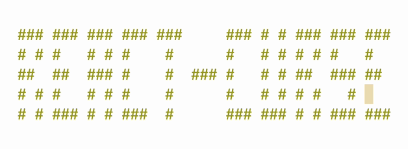<br>
  <br>
</div>

A curses-like blazingly fast react renderer

- It is fast, intuitive and easy to use
- It draws only changed characters
- It uses a small amount of SSH traffic

See it in action:


Still here? Let's go deeper:

- It has fancy components that are ready to use or can be tree-shaked from your final bundle
- It supports keyboard and mouse
- It works in fullscreen and inline modes
- It has cool hooks like animation with trail
- It is solely dependent on react
- It can generate an all-in-one bundle around 100 kb

You can easily build full-scale terminal UI applications like:

## Apps that use it

- [mngr](https://github.com/infely/mngr) - Database manager supports mongodb, mysql/mariadb, postgresql, sqlite and json-server
- [nfi](https://github.com/infely/nfi) - Simple nerd fonts icons cheat sheet that allows you to quickly find and copy glyph to clipboard

## Installation

Just run `npm init react-curse` answer a few questions and you are ready to go

## Examples

#### Hello world

```jsx
import React from 'react'
import ReactCurse, { Text } from 'react-curse'

const App = ({ text }) => {
  return <Text color="Red">{text}</Text>
}

ReactCurse.render(<App text="hello world" />)
```

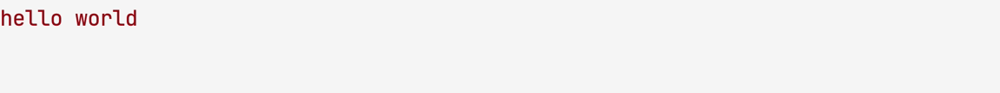

#### How to handle input

```jsx
import React, { useState } from 'react'
import ReactCurse, { Text, useInput, useExit } from 'react-curse'

const App = () => {
  const [counter, setCounter] = useState(0)

  useInput(
    input => {
      if (input === 'k') setCounter(counter + 1)
      if (input === 'j') setCounter(counter - 1)
      if (input === 'q') useExit()
    },
    [counter]
  )

  return (
    <Text>
      counter: <Text bold>{counter}</Text>
    </Text>
  )
}

ReactCurse.render(<App />)
```

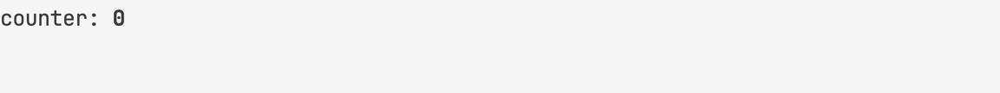

#### How to animate

```jsx
import React from 'react'
import ReactCurse, { useAnimation } from 'react-curse'

const App = () => {
  const { interpolate, interpolateColor } = useAnimation(1000)

  return <Text width={interpolate(0, 80)} background={interpolateColor('#282828', '#d79921')} />
}

ReactCurse.render(<App />)
```

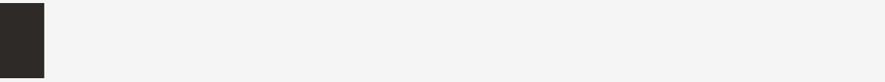

## Contents

- [Components](#components)
  - [`<Text>`](#text)
  - [`<Input>`](#input)
  - [`<Banner>`](#banner)
  - [`<Bar>`](#bar)
  - [`<Block>`](#block)
  - [`<Canvas>`](#canvas), [`<Point>`](#point), [`<Line>`](#line)
  - [`<Frame>`](#frame)
  - [`<List>`](#list)
  - [`<ListTable>`](#listtable)
  - [`<Scrollbar>`](#Scrollbar)
  - [`<Separator>`](#separator)
  - [`<Spinner>`](#spinner)
  - [`<View>`](#view)
- [Hooks](#hooks)
  - [`useAnimation`](#useanimation), [`useTrail`](#usetrail), [`<Trail>`](#trail)
  - [`useBell`](#usebell)
  - [`useChildrenSize`](#usechildrensize)
  - [`useClipboard`](#useclipboard)
  - [`useExit`](#useexit)
  - [`useInput`](#useinput)
  - [`useMouse`](#usemouse)
  - [`useSize`](#usesize)
- [API](#api)
  - [`render`](#render)
  - [`inline`](#inline)

## Components

### `<Text>`

Base component\
The only component required to do anything\
Every other component uses this one to draw

##### y?, x?: `number` | `string`

Position from top left corner relative to parent\
Content will be cropped by parent\
See `absolute` to avoid this behavior\
Example: `32, '100%', '100%-8'`

##### height?, width?: `number` | `string`

Size of block, will be cropped by parent\
See `absolute` to avoid this behavior

##### absolute?: `boolean`

Makes position and size ignoring parent container

##### background?, color?: `number` | `string`

Background and foreground color\
Example: `31, 'Red', '#f04020', '#f42'`

##### clear?: `boolean`

Clears block before drawing content\
`height` and `width`

##### block?: `boolean`

Moves cursor to a new line after its content relative to parent

##### bold?, dim?, italic?, underline?, blinking?, inverse?, strikethrough?: `boolean`

Text modifiers

#### Examples

```jsx
<Text color="Red" block>hello world</Text>
<Text color="Green" bold block>hello world</Text>
<Text color="BrightBlue" underline block>hello world</Text>
<Text y={0} x="50%">
  <Text color={128} italic block>hello world</Text>
  <Text x="100%-11" color="#1ff" strikethrough block>hello world</Text>
  <Text x="50%-5" color="#e94691" inverse>hello world</Text>
</Text>
```

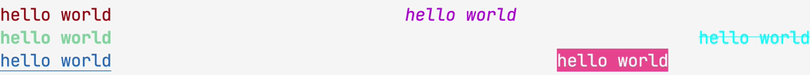

### `<Input>`

Text input component with cursor movement and text scroll support\
If its height is more than 1, then it switches to multiline, like textarea\
Most terminal shortcuts are supported

##### focus?: `boolean` = `true`

Makes it active

##### type?: `'text'` | `'password'` | `'hidden'` = `‘text'`

##### initialValue?: `string`

##### cursorBackground?: `number` | `string`

##### onCancel?: `() => void`

##### onChange?: `(string) => void`

##### onSubmit?: `(string) => void`

#### Examples

```jsx
<Input background="#404040" height={1} width={8} />
```

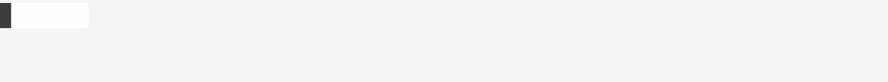

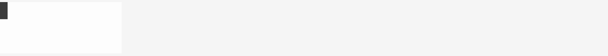

### `<Banner>`

Displays big text

##### y?, x?: `number` | `string`

##### background?, color?: `number` | `string`

##### children: `string`

#### Examples

```jsx
<Banner>{new Date().toTimeString().substring(0, 8)}</Banner>
```

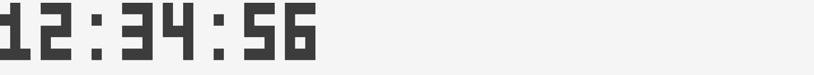

### `<Bar>`

Displays vertical or horizontal bar with 1/8 character resolution

##### type: `'vertical'` | `'horizontal'`

##### y & height, x & width: `number`

#### Examples

```jsx
<>
  {[...Array(24)].map((_, index) => (
    <Bar key={index} type="vertical" x={index * 2} height={(index + 1) / 8} />
  ))}
</>
```

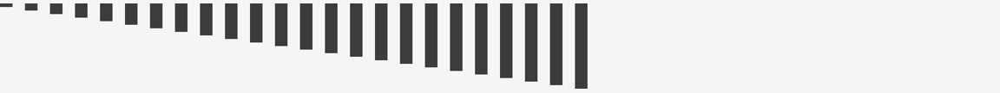

Compare to `<Text>`

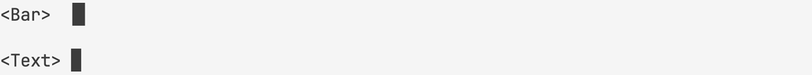

### `<Block>`

Aligns content

##### width?: `number`

##### align?: `'left'` | `'center'` | `'right'` = `'left'`

#### Examples

```jsx
<Block>left</Block>
<Block align="center">center</Block>
<Block align="right">right</Block>
```

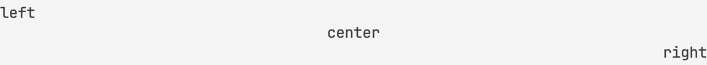

### `<Canvas>`

Create a canvas for drawing with one these modes

##### mode: `{ h: 1, w: 1 }` | `{ h: 2, w: 1 }` | `{ h: 2, w: 2 }` | `{ h: 4, w: 2 }`

Pixels per character

##### height, width: `number`

Size in pixels

##### children: (`Point` | `Line`)`[]`

#### `<Point>`

Draws a point at the coordinates

##### y, x: `number`

##### color?: `number` | `string`

#### `<Line>`

Draws a line using coordinates

##### y, x, dy, dx: `number`

##### color?: `number` | `string`

#### Examples

```jsx
<Canvas width={80} height={6}>
  <Point x={1} y={1} color="Yellow" />
  <Line x={0} y={5} dx={79} dy={0} />
</Canvas>
```

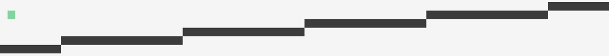

Braille's font demo (`{ h: 4, w: 2 }`)

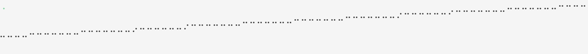

### `<Frame>`

Draws frame around its content

##### children: `string`

##### type?: `'single'` | `'double'` | `'rounded'` = `'single'`

##### height?, width?: `number`

#### Examples

```jsx
<Frame type="single" color="Red">single border type</Frame>
<Frame type="double" color="Green" y={0}>double border type</Frame>
<Frame type="rounded" color="Blue" y={0}>rounded border type</Frame>
```

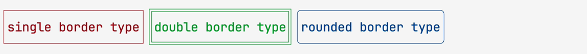

### `<List>`

Creates a list with navigation support\
Vim shortcuts are supported

##### focus?: `boolean`

##### initialPos?: { y: `number` }

##### data?: `any[]`

##### renderItem?: `(object) => JSX.Element`

##### height?, width?: `number`

##### scrollbar?: `boolean`

##### scrollbarBackground?: `boolean`

##### scrollbarColor?: `boolean`

##### vi?: `boolean` = `true`

##### pass?: `any`

##### onChange?: `(object) => void`

##### onSubmit?: `(object) => void`

#### Examples

```jsx
const items = [...Array(8)].map((_, index) => ({ id: index + 1, title: `Task ${index + 1}` }))
return (
  <List
    data={items}
    renderItem={({ item, selected }) => <Text color={selected ? 'Green' : undefined}>{item.title}</Text>}
  />
)
```

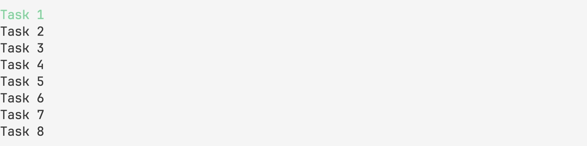

### `<ListTable>`: `<List>`

Creates a table with navigation support\
Vim shortcuts are supported

##### mode?: `'cell'` | `'row'` = `'cell'`

##### head?: `any[]`

##### renderHead?: `(object) => JSX.Element`

##### data?: `any[][]`

#### Examples

```jsx
const head = ['id', 'title']
const items = [...Array(8)].map((_, index) => [index + 1, `Task ${index + 1}`])
return (
  <ListTable
    head={head}
    renderHead={({ item }) =>
      item.map((i, key) => (
        <Text key={key} width={8}>
          {i}
        </Text>
      ))
    }
    data={items}
    renderItem={({ item, x, y, index }) =>
      item.map((text, key) => (
        <Text key={key} color={y === index && x === key ? 'Green' : undefined} width={8}>
          {text}
        </Text>
      ))
    }
  />
)
```

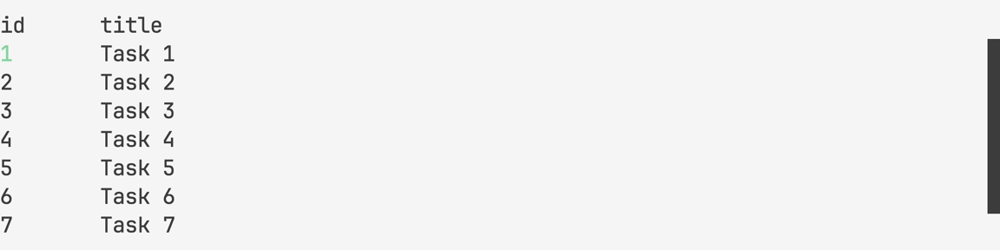

### `<Scrollbar>`

Draws a scrollbar with 1/8 character resolution

##### type?: `'vertical'` | `'horizontal'` = `'vertical'`

##### offset: `number`

##### limit: `number`

##### length: `number`

##### background?, color?: `number` | `string`

#### Examples

```jsx
<Scrollbar type="horizontal" offset={10} limit={80} length={160} />
```


### `<Separator>`

Draws a vertical or horizontal line

##### type: `'vertical'` | `'horizontal'`

##### height, width: `number`

#### Examples

```jsx
<Separator type="vertical" height={3} />
<Separator type="horizontal" y={1} x={1} width={79} />
```

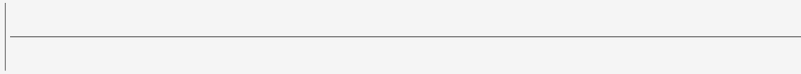

### `<Spinner>`

Draws an animated spinner

##### children?: `string`

#### Examples

```jsx
<Spinner block />
<Spinner color="BrightGreen">-\|/</Spinner>
```


### `<View>`

Creates a scrollable viewport\
Vim shortcuts are supported

##### focus?: `boolean`

##### height?: `number`

##### scrollbar?: `boolean`

##### vi?: `boolean` = `true`

##### children: `any`

#### Examples

```jsx
<View>{JSON.stringify(json, null, 2)}</View>
```

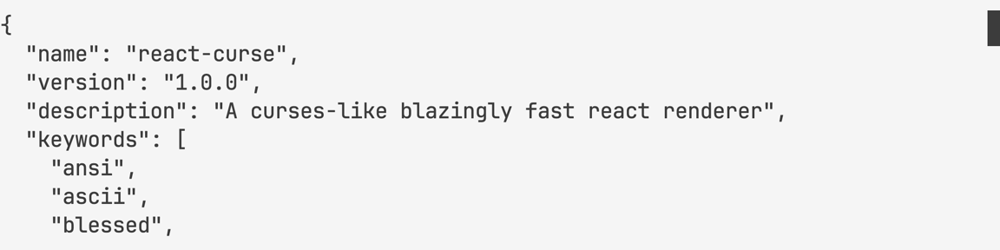

## hooks

### `useAnimation`

##### (time: `number`, fps?: `'number'` = `60`) => `object`

Creates a timer for a specified duration\
That gives you time and interpolation functions each frame of animation

#### return

##### ms: `number`

##### interpolate: (from: `number`, to: `number`, delay?: `number`)

##### interpolateColor: (from: `string`, to: `string`: delay?: `number`)

#### Examples

```jsx
const { ms } = useAnimation(1000, 4)
return ms // 0, 250, 500, 750, 1000
```

```jsx
const { interpolate } = useAnimation(1000, 4)
return interpolate(0, 80) // 0, 20, 40, 60, 80
```

```jsx
const { interpolateColor } = useAnimation(1000, 4)
return interpolateColor('#000', '#0f8') // #000, #042, #084, #0c6, #0f8
```

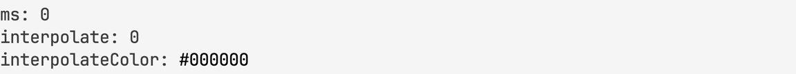

#### `<Trail>`

Mutate array of items to show one by one with latency

##### delay: `number`

##### children: `JSX.Element[]`

#### Examples

```jsx
const items = [...Array(8)].map((_, index) => ({ id: index + 1, title: `Task ${index + 1}` }))
return (
  <Trail delay={100}>
    {items.map(({ id, title }) => (
      <Text key={id} block>
        {title}
      </Text>
    ))}
  </Trail>
)
```

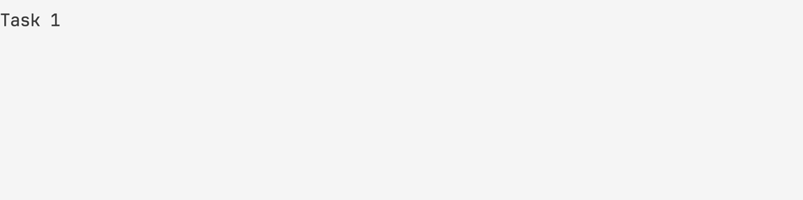

#### `useTrail`

##### (delay: `number`, items: `JSX.Element[]`, key?: `string` = `'key'`) => `JSX.Element[]`

Same as `<Trail>` but hook\
You can pass it to `data` property of `<List>` component for example

#### Examples

```jsx
<List data={useTrail(items)} />
```

### `useBell`

#### () => `void`

Makes a terminal bell

```jsx
useBell() // ding
```

### `useChildrenSize`

##### (value: `string`) => `object`

Gives you content size

#### return

##### height, width: `number`

#### Examples

```jsx
useChildrenSize('1\n22\n333') // { height: 3, width: 3 }
```

### `useClipboard`

#### () => `array`

Allows you to work with the system clipboard

#### return

##### getClipboard: `() => string`

##### setClipboard: `(value: string) => void`

#### Examples

```jsx
const { getClipboard, setClipboard } = useClipboard()
const string = getClipboard()
setClipboard(string.toUpperCase()) // copied
```

### `useExit`

##### (code: `number` = `0`) => `void`

Allows you to exit from an application that waits for user input or has timers

#### Examples

```jsx
useInput(input => {
  if (input === 'q') useExit()
})
```

### `useInput`

##### (callback: `(string) => void`, dependencies: `any[]`) => `void`

Allows you to handle keyboard input

#### Examples

```jsx
set[(counter, setCounter)] = useState(0)

useInput(
  input => {
    if (input === 'k') setCounter(counter + 1)
    if (input === 'j') setCounter(counter - 1)
  },
  [counter]
)
```

### `useMouse`

##### (callback: `(object) => void`, dependencies: `any[]`)

Allows you to handle mouse input

#### Examples

```jsx
set[(counter, setCounter)] = useState(0)

useMouse(
  event => {
    if (event.type === 'wheelup') setCounter(counter + 1)
    if (event.type === 'wheeldown') setCounter(counter - 1)
  },
  [counter]
)
```

### `useSize`

##### () => `object`

Gives you terminal size\
Updates when size is changing

#### return

##### height, width: `number`

#### Examples

```jsx
useSize() // { height: 24, width: 80 }
```

### `useWordWrap`

##### (text: `string`, width?: `number`) => `object`

Gives your text a word wrap

#### return

##### height, width: `number`

#### Examples

```jsx
useWordWrap('hello world', 5) // hello\nworld
```

## API

### `render` (children: `JSX.Element`) => `void`

Renders your fullscreen application to `stdout`

### `inline` (children: `JSX.Element`) => `void`

Renders your inline application to `stdout`
